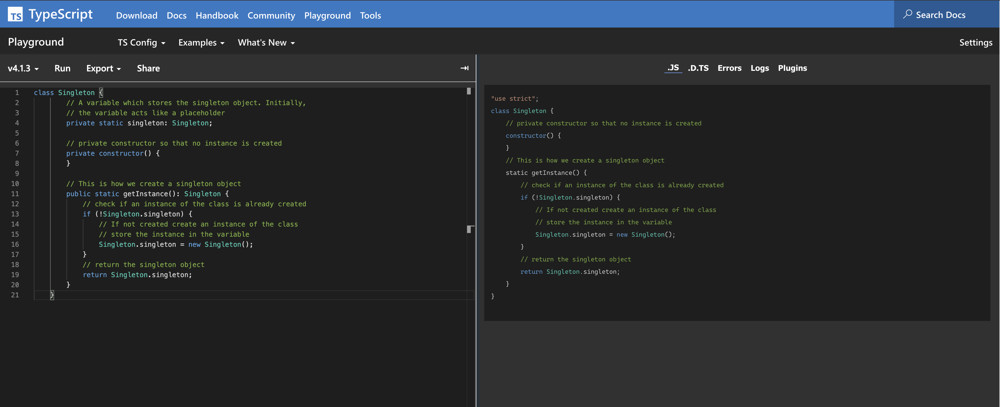

# Typescript 4 Design Patterns and Best Practices

This is the code repository for Typescript 4 Design Patterns and Best Practices, published by Packt.

## How to run the code examples?

To be able to run the examples, you first need to install all the required dependencies using the following command:

```sh
npm install
```

We have configured a local version of `ts-node` and `Typescript` so you don't have to install globally.

If you have compatible TypeScript compiler installed globally, you can just use the global `ts-node` command to run target code bundle.

You can then run the `ts` npm task providing the relative path of the script:

```
npm run ts -- chapters/smoke.ts
> ts-node "chapters/smoke.ts"
1
2
3
4
Hello
1
```

Alternatiely you may want to build and run the compiled javascript from the `dist` folder:

```
npm run build
> npx tsc --build chapters

node dist/smoke.js
1
2
3
4
Hello
1
```

In some cases you may want to quickly see the compiled javascript or to quickly test some examples using the [TypeScript Playground](https://www.typescriptlang.org/play/index.html). You can copy the code in the playground (left) to get the resulting JavaScript output (right)



## Code examples

- [Chapter 1: Getting Started With Typescript 4](./chapters/chapter-1_Getting_Started_With_Typescript_4/)
